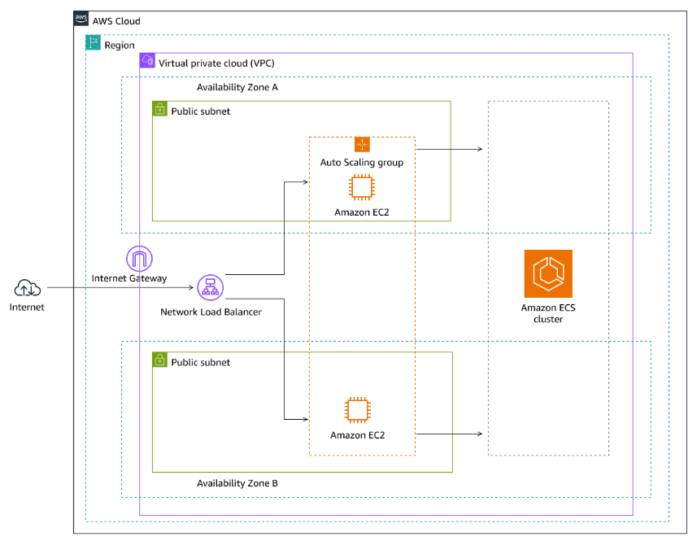
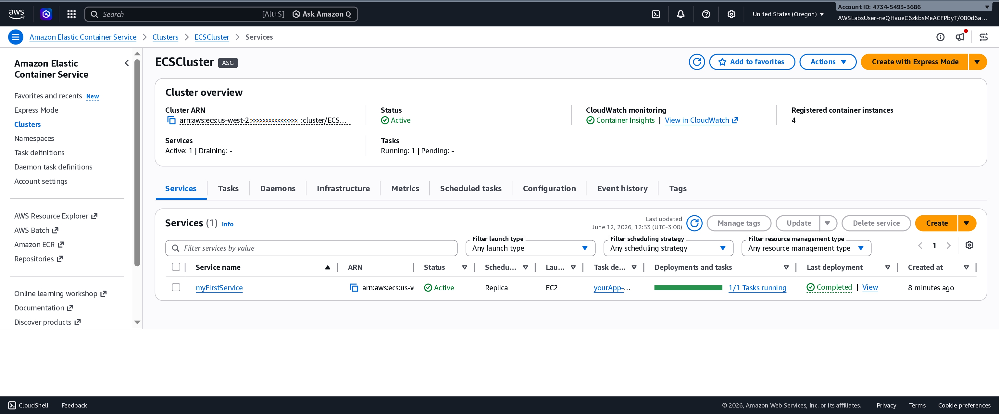
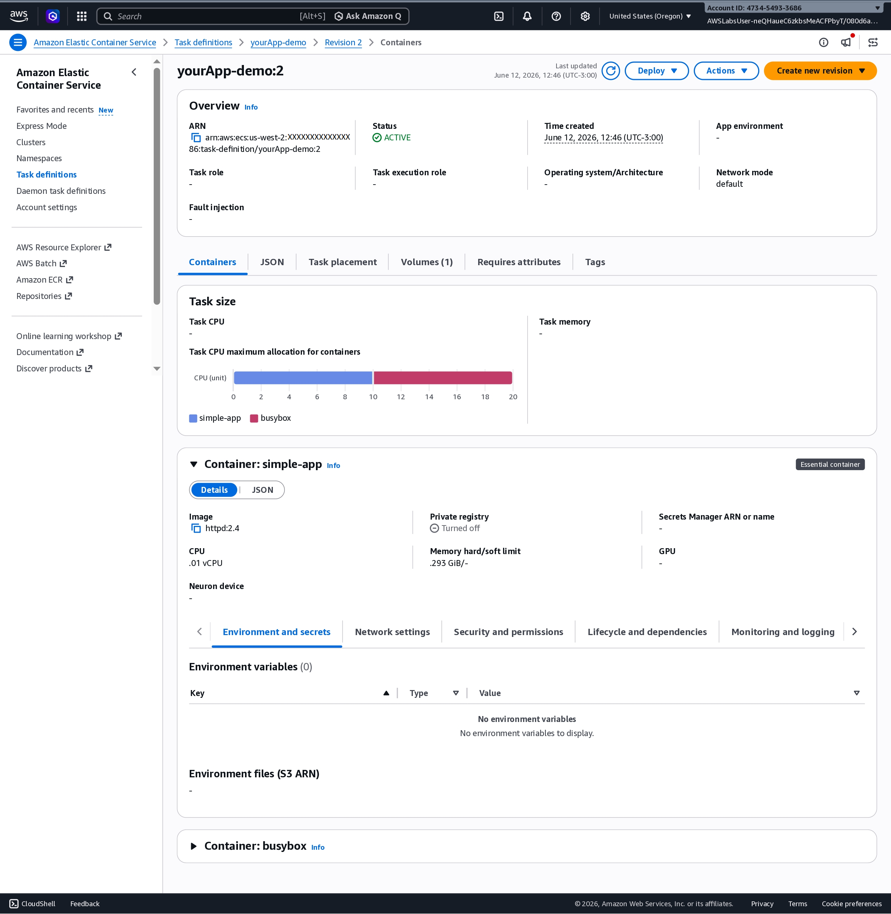
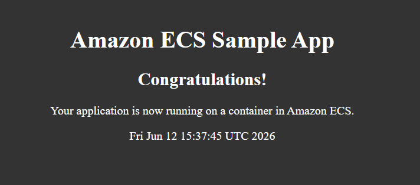
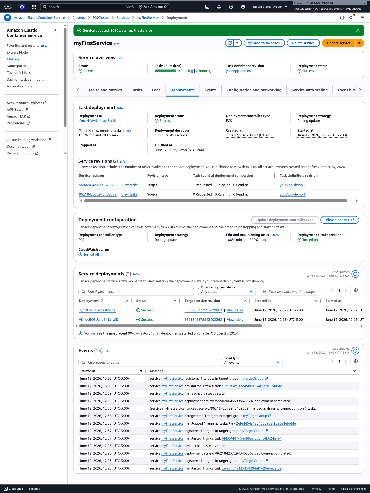
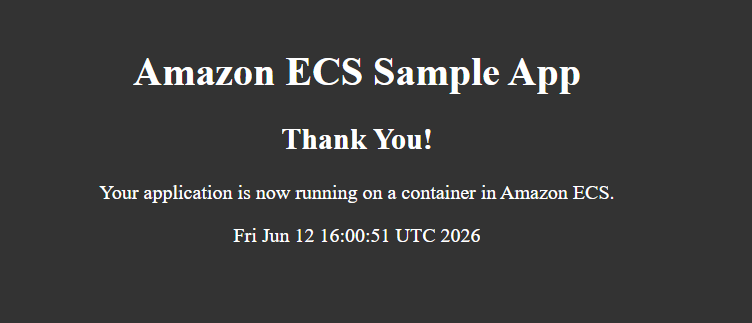

# AWS Working with Amazon ECS


Hands-on lab demonstrating container orchestration using Amazon Elastic Container Service (ECS).

## Architecture



## Architecture Overview

This lab environment consists of:

- Amazon VPC
- Two Public Subnets
- Internet Gateway
- Network Load Balancer
- Amazon ECS Cluster
- Amazon EC2 Container Instances
- Auto Scaling Group

Traffic flow:

```text
Internet
    ↓
Network Load Balancer
    ↓
ECS Service
    ↓
ECS Tasks
```

## AWS Services Used

- Amazon ECS
- Amazon EC2
- Auto Scaling Group
- Network Load Balancer
- Amazon VPC
- AWS CloudFormation


## Infrastructure as Code

The CloudFormation template used in this lab is available in:

```text
cloudformation/ecs-service-template.json
```

The template provisions and configures ECS-related resources required for the lab environment.


The lab environment was provisioned using AWS CloudFormation.

Main resources:

- Amazon ECS Cluster
- Auto Scaling Group
- EC2 Container Instances
- Network Load Balancer
- Amazon VPC


## Lab Objectives

- Create ECS Task Definitions
- Deploy ECS Services
- Update Applications
- Scale Running Services

## ECS Task Definition

The application is composed of two containers:

### simple-app

- Image: `httpd:2.4`
- Exposes port 80
- Serves web content through Apache HTTP Server

### busybox

- Image: `busybox`
- Generates dynamic HTML content
- Updates the application page continuously

Both containers share a Docker volume, demonstrating the Sidecar Container Pattern.

## Deployment Workflow

1. Create Task Definition Revision 1
2. Deploy ECS Service
3. Validate application through Network Load Balancer
4. Create Task Definition Revision 2
5. Perform rolling deployment update
6. Scale service from 1 to 2 tasks


## ECS Service Deployment

An ECS Service named `myFirstService` was created using the EC2 launch type.

Configuration highlights:

- Cluster: ECSCluster
- Launch Type: EC2
- Scheduling Strategy: Replica
- Desired Tasks: 1
- Running Tasks: 1
- Load Balancer: Network Load Balancer
- Deployment Status: Completed

The ECS scheduler automatically maintained the desired task count and distributed workloads across the available container instances.


## Application Validation

The application was successfully deployed and accessed through the Network Load Balancer.

Initial application response:

- Amazon ECS Sample App
- Congratulations!

This confirmed that the ECS Service, EC2 container instances, shared volume configuration, and Network Load Balancer were functioning correctly.


## Repository Structure

```text
aws-working-with-amazon-ecs/
├── architecture/
│   └── ecs-lab-architecture.png
├── screenshots/
├── cloudformation/
└── README.md
```


## Screenshots

### Task Definition Revision 1


### ECS Service Creation



### Task Definition Revision 2




### Application Version 1




### Rolling Deployment



The ECS Service was updated to use Task Definition Revision 2 (`yourApp-demo:2`).

Deployment details:

- Deployment Controller: ECS
- Deployment Strategy: Rolling Update
- Minimum Healthy Tasks: 100%
- Maximum Running Tasks: 200%
- Deployment Status: Success

During the deployment process, Amazon ECS launched new tasks using the updated task definition and gracefully terminated the previous tasks, ensuring zero downtime.

The service successfully transitioned from:

- yourApp-demo:1
- Message: "Congratulations!"

to:

- yourApp-demo:2
- Message: "Thank You!"

## Service Scaling

The ECS Service capacity was increased from 1 to 2 desired tasks.

Amazon ECS automatically launched an additional task and distributed workloads across the available container instances, demonstrating horizontal scaling capabilities.


### Application Version 2




## Skills Demonstrated

- Container Orchestration
- Amazon ECS
- ECS Service Management
- Docker Concepts
- Sidecar Container Pattern
- Rolling Deployments
- Load Balancing
- Network Load Balancer Integration
- Container Networking
- High Availability
- Horizontal Scaling
- Infrastructure as Code (CloudFormation)

## Learning Outcomes

By completing this lab, I gained practical experience with:

- Creating and managing ECS Task Definitions
- Deploying applications using ECS Services
- Integrating ECS with a Network Load Balancer
- Performing rolling application updates
- Scaling ECS services horizontally
- Understanding container communication through shared volumes
- Reviewing Infrastructure as Code (IaC) using AWS CloudFormation
- Deploying multi-container applications on Amazon ECS
- Managing ECS service revisions and deployments

## Author

Ze Mendes

Cloud | Cybersecurity | DevOps
